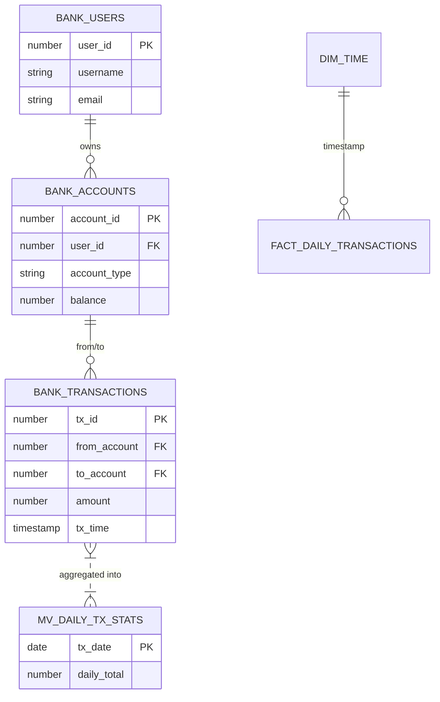

# 📊 Enterprise Bank ERD (Mermaid)

```mermaid
erDiagram
    BANK_USERS ||--o{ BANK_ACCOUNTS : "owns"
    BANK_ACCOUNTS ||--o{ BANK_TRANSACTIONS : "from/to"
    BANK_TRANSACTIONS }|..|{ MV_DAILY_TX_STATS : "aggregated into"
    DIM_TIME ||--o{ FACT_DAILY_TRANSACTIONS : "timestamp"

    BANK_USERS {
        number user_id PK
        string username
        string email
    }

    BANK_ACCOUNTS {
        number account_id PK
        number user_id FK
        string account_type
        number balance
    }

    BANK_TRANSACTIONS {
        number tx_id PK
        number from_account FK
        number to_account FK
        number amount
        timestamp tx_time
    }

    MV_DAILY_TX_STATS {
        date tx_date PK
        number daily_total
    }
```
